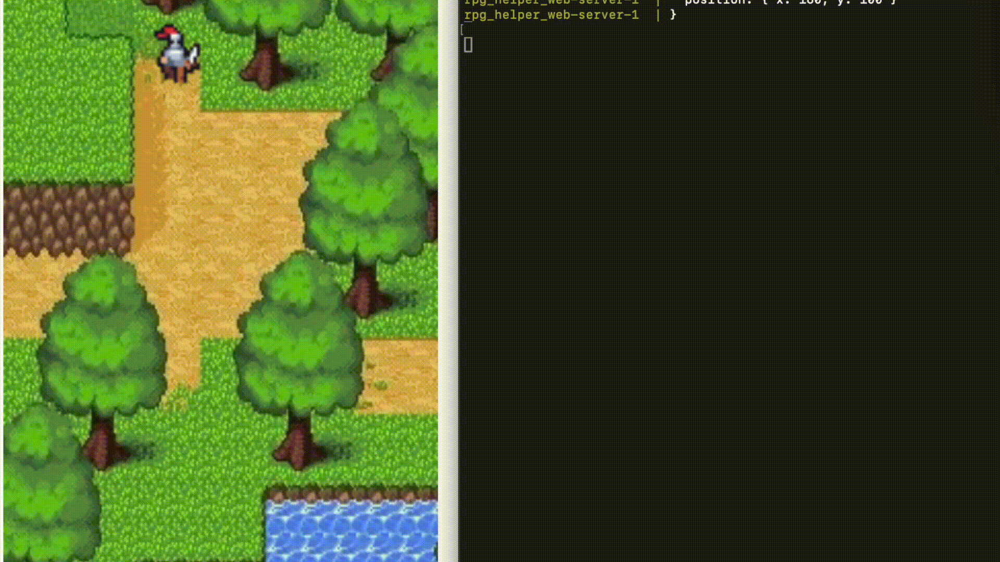

# RPG Helper Web

A multiplayer, browser-based RPG sandbox designed to help players create and play encounters while keeping the focus on storytelling. 

This project is structured as a three-layer application:

•	Client-side application: A TypeScript-based web frontend built with Webpack, responsible for user interaction, rendering, and animations.

•	Server: A Node.js backend using Express.js and Socket.IO to manage real-time communication and game state synchronization. It exposes a REST API for triggering events and retrieving the current game state.

•	Shared mechanics core: A TypeScript module (@rpg_helper_web/shared_core) that implements the core logic, including the GameState and StateMachine.

Clients send game events through WebSockets or REST (/api/event), which the server applies to a central state and broadcasts back to all connected clients. The result is a collaborative, real-time RPG environment that enhances immersion and supports external integrations.




## Setup

1. Clone the repository
```sh
git clone https://github.com/tiagopvianna/rpg_helper_web.git
cd rpg_helper_web
```

2. Run the game using Docker
```sh
docker-compose up --build
```

3. Access the game in your browser
```sh
http://localhost:8080
```

4. Stop the game
```sh
docker-compose down
```

## Usage

Add events to the state machine
```sh
curl -X POST \
-H "Content-Type: application/json" \
-d '{
 "type": "PLAYER_MOVED",
 "playerId": "local",
 "position": {
 "x": 200,
 "y": 400
 }
}' \
http://localhost:3000/api/event
```